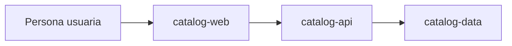

# Catálogo de recursos — demo

> **Simulación.** Este proyecto, sus componentes y sus cambios son ficticios. Las tareas marcadas solo sirven para probar el progreso documental del visor.

El sistema permite consultar recursos compartidos y leer sus fichas. La demo tiene tres componentes genéricos, descritos también en `repositorios.json`.

| Componente | Responsabilidad |
| --- | --- |
| catalog-web | Presentar el catálogo y sus fichas |
| catalog-api | Resolver consultas y exponer los datos |
| catalog-data | Mantener los registros de ejemplo |

## Mapa del sistema

## Alcance de esta demo

- `catalog-search`: cambio activo con propuesta, diseño, tareas y especificación delta.
- `export-summary`: idea activa que todavía tiene solo una propuesta.
- `2026-09-15-catalog-detail`: ejemplo archivado, ficticiamente finalizado.
- `openspec/specs/catalog/spec.md`: especificación canónica del catálogo antes de incorporar la búsqueda propuesta.

No contiene credenciales, rutas a sistemas reales ni identidades de aprobación. La extensión puede leerla sin conectarse a ningún servicio.
