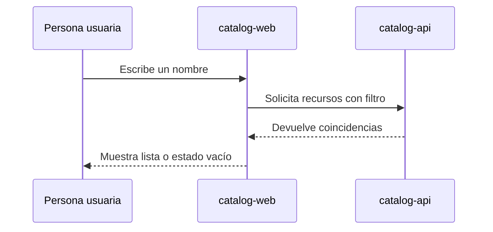

# Diseño de búsqueda

> **Simulación:** diseño documental de ejemplo, sin implementación ni validación real.

## Decisión propuesta

La interfaz envía el texto de búsqueda al servicio del catálogo. El servicio compara el texto con el nombre de cada recurso sin distinguir mayúsculas y devuelve la lista filtrada.

## Casos a cubrir

- Texto vacío: recuperar la lista completa.
- Coincidencias: mantener el acceso a cada ficha.
- Sin coincidencias: ofrecer limpiar el filtro.

## Pendiente

Definir el comportamiento ante errores del servicio durante la implementación. Ninguna decisión de esta demo expresa aprobación de un proyecto real.
